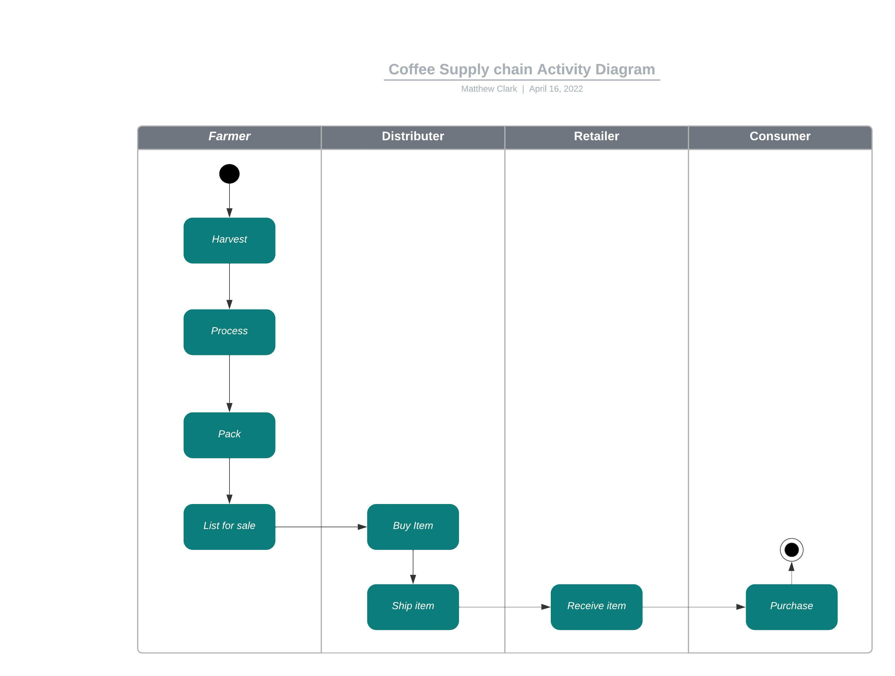
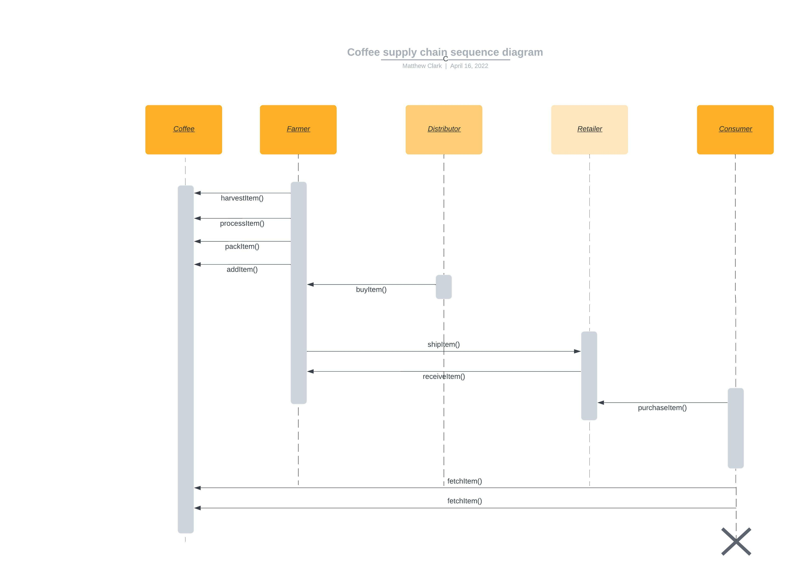
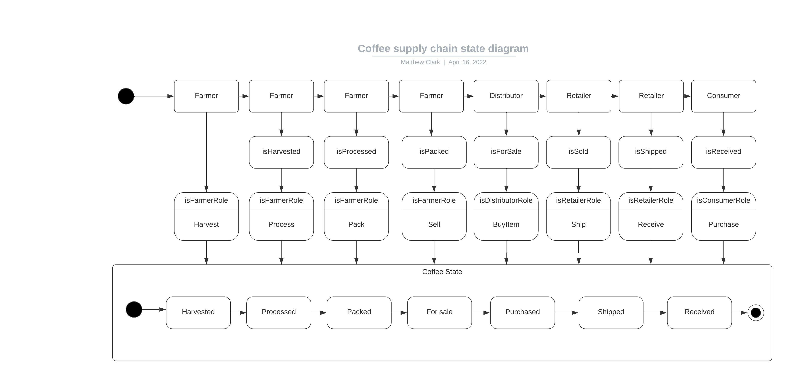
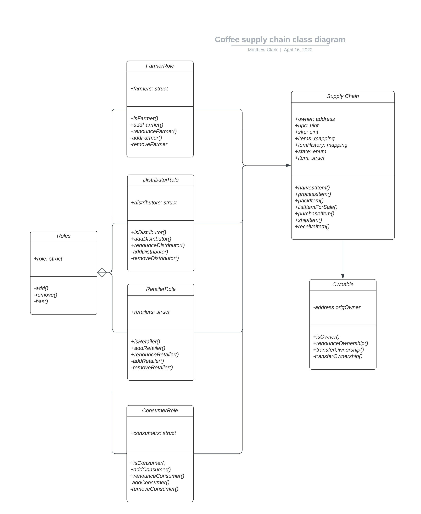

# Supply chain & data auditing

This repository containts an Ethereum DApp that demonstrates a Supply Chain flow between a Seller and Buyer. The user story is similar to any commonly used supply chain process. A Seller can add items to the inventory system stored in the blockchain. A Buyer can purchase such items from the inventory system. Additionally a Seller can mark an item as Shipped, and similarly a Buyer can mark an item as Received.

The DApp User Interface when running should look like...


## Getting Started

These instructions will get you a copy of the project up and running on your local machine for development and testing purposes. See deployment for notes on how to deploy the project on a live system.

### Prerequisites

Please make sure you've already installed ganache-cli, Truffle and enabled MetaMask extension in your browser.

```
Give examples (to be clarified)
```

### Installing

> The starter code is written for **Solidity v0.4.24**. At the time of writing, the current Truffle v5 comes with Solidity v0.5 that requires function *mutability* and *visibility* to be specified (please refer to Solidity [documentation](https://docs.soliditylang.org/en/v0.5.0/050-breaking-changes.html) for more details). To use this starter code, please run `npm i -g truffle@4.1.14` to install Truffle v4 with Solidity v0.4.24. 

A step by step series of examples that tell you have to get a development env running

Clone this repository:

```
git clone https://github.com/udacity/nd1309/tree/master/course-5/project-6
```

Change directory to ```project-6``` folder and install all requisite npm packages (as listed in ```package.json```):

```
cd project-6
npm install
```

Launch Ganache:

```
ganache-cli -m "spirit supply whale amount human item harsh scare congress discover talent hamster"
```

Your terminal should look something like this:


In a separate terminal window, Compile smart contracts:

```
truffle compile
```

Your terminal should look something like this:


This will create the smart contract artifacts in folder ```build\contracts```.

Migrate smart contracts to the locally running blockchain, ganache-cli:

```
truffle migrate
```

Your terminal should look something like this:


Test smart contracts:

```
truffle test
```

All 10 tests should pass.


In a separate terminal window, launch the DApp:

```
npm run dev
```

## Built With

* [Ethereum](https://www.ethereum.org/) - Ethereum is a decentralized platform that runs smart contracts
* [IPFS](https://ipfs.io/) - IPFS is the Distributed Web | A peer-to-peer hypermedia protocol
to make the web faster, safer, and more open.
* [Truffle Framework](http://truffleframework.com/) - Truffle is the most popular development framework for Ethereum with a mission to make your life a whole lot easier.


## Authors

See also the list of [contributors](https://github.com/your/project/contributors.md) who participated in this project.

## Acknowledgments

* Solidity
* Ganache-cli
* Truffle
* IPFS

## Libraries used:
Node: v1.18.1
Truffle: v4.1.14
Solidity: v0.4.24

## Contracts Info
Supply Chain -
Txn: 0x689c041712d4d52d0cb39aacb16a15ab12d6cc06e0a10e55e4db8291c35f974e
Contract Address: 0xe807d5061f4111e5a72e232ffec7a5545e5943e3

ConsumerRole - 
Txn: 0xc0dd9e3a1b1d5a124ad9fb2dbba6bc8e0d6a8036593eb78d540b25996bcfa32a
Contract Address: 0x9fa83a3273448f9d58fec6cb275cea64f9dd0f6d

RetailerRole - 
Txn: 0x7e7e7ba524f888ebe20fd11eb52801039ddca559e5c8135d3191f8c7763c1482
Contract Address: 0x91e5407542d1bc85d470ac78dd44404e32e82829

DistributorRole - 
Txn: 0xb052322427d1fa565bb6798ea00a2ffe1542aaca8e45f3d8a8d05f09ed8b0987
Contract Address: 0xb0b4e1d15135632d6cf5468a88c74bbaab0bc344

FarmerRole - 
Txn: 0x6880564cc53d64e6d29e67897f964b9143e3e13053a10a3c67d2c20c7cc30125
Contract Address: 0xe4ed5456703af8c0922f33977515f57e9c6286e1

## UML:





